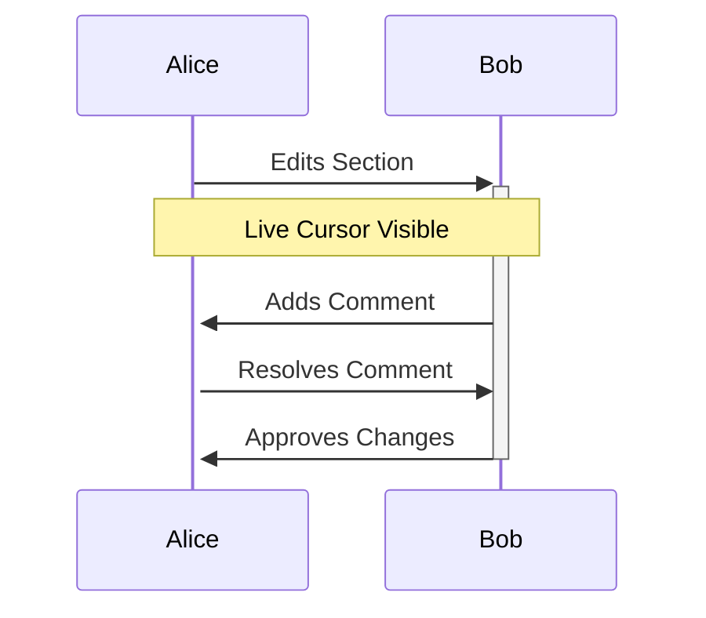

## Inviting Collaborators

You invite team members by sharing space or document links with edit permissions. Use email invites or integrate with SSO providers like Google Workspace for seamless onboarding. Set role-based access: viewers for read-only, editors for contributions, admins for management.

<Callout kind="success">
  Invites expire after `7 days` for security; resend if needed.
</Callout>

<Steps>
  <Step title="Send Invite" icon="mail">
    Open space settings and select `Invite Members`.
    
    Enter emails, choose roles, and add a welcome message. Collaborators receive notifications upon acceptance.
  </Step>
  <Step title="Manage Access" icon="settings">
    Review members list to adjust permissions or remove users.
    
    Audit logs track who accessed what and when.
  </Step>
  <Step title="SSO Setup" icon="shield">
    Enable in account settings for enterprise teams.
    
    Configure providers to sync user directories automatically.
  </Step>
</Steps>

## Real-Time Editing

Multiple users edit documents simultaneously with live cursors showing positions. Changes appear instantly, with conflict resolution via accept/reject prompts. Lock sections for sensitive content to prevent overlaps.

<Tabs>
  <Tab title="Live Cursors" icon="users">
    See colored cursors for each editor. Avatars display names for identification.
    
    <Image
      src="https://example.com/cursors.png"
      alt="Live editing cursors in action"
      width="800"
      height="500"
    />
  </Tab>
  <Tab title="Comments" icon="message-square">
    Add inline comments for feedback without altering text.
    
    @mention users to notify them directly. Resolve comments once addressed.
  </Tab>
</Tabs>

<Columns cols={2}>
  <Card title="Version History" icon="clock" href="#">
    View diffs between versions. Restore previous states easily.
  </Card>
  <Card title="Notifications" icon="bell" href="#">
    Get alerts for mentions, edits, or approvals.
  </Card>
</Columns>

## Review and Approval Workflows

You set up workflows for peer review before publishing. Assign reviewers and track status: draft, review, approved. Use checklists within documents for structured feedback.

<CodeGroup tabs="Workflow Setup,API Integration">
  ````javascript
// Set up approval workflow
const workflow = await paperguide.createWorkflow({
  documentId: '123',
  reviewers: ['user1@example.com', 'user2@example.com'],
  stages: ['draft', 'review', 'publish']
});
````
  ````python
# Integrate with external tools
workflow = paperguide.workflow_create(
  doc_id='123',
  reviewers=['user1', 'user2'],
  stages=['draft', 'review', 'publish']
)
````
</CodeGroup>

<Expandable title="Handling Conflicts">
  When edits collide, Paperguide highlights differences. You choose to keep yours, theirs, or merge manually. For complex cases, branch the document to work in parallel and merge later.
</Expandable>

<ExpandableGroup>
  <Expandable title="Best Practices for Teams">
    Establish guidelines for commenting and editing. Schedule regular sync meetings to align on doc goals. Use templates for recurring doc types to standardize collaboration.
  </Expandable>
  <Expandable title="Integration with Tools">
    Connect to Slack for real-time alerts or GitHub for version syncing. Automate pulls from repos to keep docs current with code changes.
  </Expandable>
</ExpandableGroup>

## Scaling Collaboration

For large teams, you use channels within spaces for topic-based discussions. Analytics track contribution metrics to recognize active members. Export collaboration reports for performance reviews.



| Feature | Benefit | Use Case |
|---------|---------|----------|
| Real-Time | Instant Feedback | Brainstorming Sessions |
| Comments | Non-Disruptive | Review Cycles |
| Workflows | Structured Process | Compliance Docs |

Paperguide fosters productive teamwork by minimizing friction in co-authoring. You build shared knowledge bases that evolve with your projects, ensuring everyone stays aligned and informed. This collaborative environment accelerates documentation delivery and improves overall project outcomes.