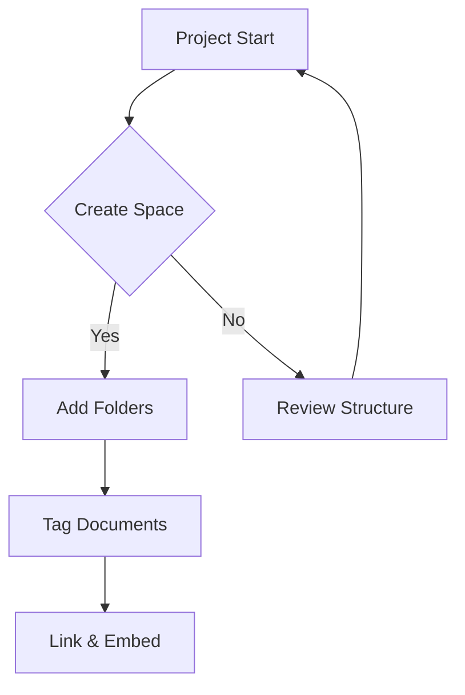

## Space Management

You manage documentation by creating spaces to group related content. Each space functions as a workspace with its own permissions and settings. Start by assessing your project's needs to decide on space granularity—use one per major initiative or topic.

<Callout kind="alert">
  Limit spaces to `10-15` active ones to avoid navigation overload.
</Callout>

<Columns cols={3}>
  <Card title="Create Space" icon="plus" href="#">
    Add new spaces via dashboard. Assign owners and collaborators upfront.
  </Card>
  <Card title="Archive Old Spaces" icon="archive" href="#">
    Move inactive spaces to archive for cleanup without deletion.
  </Card>
  <Card title="Permissions" icon="lock" href="#">
    Set read/write access per role: admin, editor, viewer.
  </Card>
</Columns>

## Folder and Tagging System

Within spaces, you use folders to create hierarchies. Nest folders up to three levels deep for clarity. Complement this with tags for cross-referencing—apply multiple tags like `api`, `v2`, `internal` to a single document.

<Tabs>
  <Tab title="Folders" icon="folder">
    Drag documents between folders to reorganize. Folders inherit space permissions but allow finer controls.
    
    <Steps>
      <Step title="New Folder" icon="plus">
        Right-click in the space view and select `New Folder`.
        
        Name it descriptively, e.g., `User Guides`.
      </Step>
      <Step title="Move Docs" icon="move">
        Select documents and drag to target folder.
        
        Confirm the action to update links if needed.
      </Step>
    </Steps>
  </Tab>
  <Tab title="Tags" icon="tag">
    Add tags during document creation or edit metadata.
    
    Search by tag to filter content across spaces. Tags support colors for visual distinction.
  </Tab>
</Tabs>

## Document Linking and Navigation

You link documents using relative paths or IDs for seamless navigation. Embed previews of linked docs to provide context without leaving the page. The sidebar shows a dynamic outline based on your current space and folder.

<CodeGroup tabs="Linking,Embedding">
  ````markdown
[Go to Setup Guide](../setup.md)

Or use ID: [Setup](doc://12345)
````
  ````markdown
{embed: doc://67890 width=600 height=400}

Displays a live preview of the linked document.
````
</CodeGroup>

<ExpandableGroup>
  <Expandable title="Best Practices for Organization">
    Maintain a table of contents at the space level. Review structure quarterly to merge redundant folders. Use consistent naming: prefix with numbers for ordering, like `01-Introduction`.
  </Expandable>
  <Expandable title="Search Optimization">
    Include keywords in titles and tags. Avoid overly long folder paths to keep URLs clean. Enable full-text search indexing for better results.
  </Expandable>
</ExpandableGroup>

## Advanced Organization

For larger teams, you implement templates for consistent doc formats. Automate folder creation via API for dynamic projects. Integrate with external tools like Jira to sync tickets as documents.



| Organization Level | Tool | Benefit |
|--------------------|------|---------|
| Space             | Permissions | Secure access |
| Folder            | Nesting     | Hierarchy     |
| Document          | Tags        | Cross-search  |
| Content           | Links       | Connectivity  |

You achieve a scalable system by combining these elements. Regular audits prevent sprawl, ensuring your documentation remains accessible and useful. This approach supports growth from solo projects to enterprise-scale knowledge bases, fostering efficient information flow across your organization.